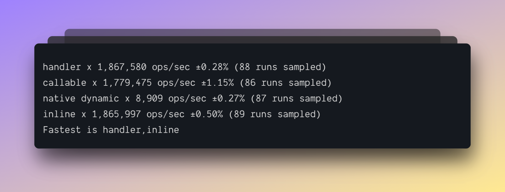

# AdonisJS Fold

> Simplest, straightforward implementation for IoC container in JavaScript

<br />

[![gh-workflow-image]][gh-workflow-url] [![npm-image]][npm-url] ![][typescript-image] [![license-image]][license-url]

## Why this project exists?

Many existing implementations of IoC containers take the concept too far and start to feel more like Java. JavaScript inherently does not have all the bells and whistles; you need to have similar IoC container benefits as PHP or Java.

Therefore, with this project, I live to the ethos of JavaScript and yet build a container that can help you create loosely coupled systems.

I have explained the [reasons for using an IoC container](https://github.com/thetutlage/meta/discussions/4) in this post. It might be a great idea to read the post first ✌️

> **Note**: AdonisJS fold is highly inspired by the Laravel IoC container. Thanks to Taylor for imaginging such a simple, yet powerful API.

## Goals of the project

- **Keep the code visually pleasing**. If you have used any other implementation of an IoC container, you will automatically find `@adonisjs/fold` easy to read and follow.
- **Keep it simple**. JavaScript projects have a few reasons for using an IoC container, so do not build features that no one will ever use or understand.
- **Build it for JavaScript and improve with TypeScript** - The implementation of `@adonisjs/fold` works with vanilla JavaScript. It's just you have to write less code when using TypeScript. Thanks to its decorators metadata API.

## Usage

Install the package from the npm packages registry.

```sh
npm i @adonisjs/fold@next

# yarn lovers
yarn add @adonisjs/fold@next

# pnpm followers
pnpm add @adonisjs/fold@next
```

Once done, you can import the `Container` class from the package and create an instance of it. For the most part, you will use a single instance of the container.

```ts
import { Container } from '@adonisjs/fold'

const container = new Container()
```

## Making classes

You can construct an instance of a class by calling the `container.make` method. The method is asynchronous since it allows for lazy loading dependencies via factory functions (More on factory functions later).

```ts
class UserService {}

const service = await container.make(UserService)
assert(service instanceof UserService)
```

In the previous example, the `UserService` did not have any dependencies; therefore, it was straightforward for the container to make an instance of it.

Now, let's look at an example where the `UserService` needs an instance of the Database class.

```ts
class Database {}

class UserService {
  static containerInjections = {
    _constructor: {
      dependencies: [Database],
    },
  }

  constructor(db) {
    this.db = db
  }
}

const service = await container.make(UserService)
assert(service.db instanceof Database)
```

The `static containerInjections` property is required by the container to know which values to inject when creating an instance of the class.

This property can define the dependencies for the class methods (including the constructor). The dependencies are defined as an array. The dependencies are injected in the same order as they are defined inside the array.

> **Do you remember?** I said that JavaScript is not as powerful as Java or PHP. This is a classic example of that. In other languages, you can use reflection to look up the classes to inject, whereas, in JavaScript, you have to tell the container explicitly.

### TypeScript to the rescue

Wait, you can use decorators with combination of TypeScript's [emitDecoratorMetaData](https://www.typescriptlang.org/tsconfig#emitDecoratorMetadata) option to perform reflection. You will also need to install [`reflect-metadata`](https://www.npmjs.com/package/reflect-metadata) in order for TypeScript to extract metadata from your classes.

It is worth noting, TypeScript decorators are not as powerful as the reflection API in other languages. For example, in PHP, you can use interfaces for reflection. Whereas in TypeScript, you cannot.

With that said, let's look at the previous example, but in TypeScript this time.

```ts
import { inject } from '@adonisjs/fold'

class Database {}

@inject()
class UserService {
  constructor(db: Database) {
    this.db = db
  }
}

const service = await container.make(UserService)
assert(service.db instanceof Database)
```

The `@inject` decorator looks at the types of all the constructor parameters and defines the `static containerInjections` property behind the scenes.

> **Note**: The decorator-based reflection can only work with concrete values, not with interfaces or types since they are removed during the runtime.

## Making class with runtime values

When calling the `container.make` method, you can pass runtime values that take precedence over the `containerInjections` array.

In the following example, the `UserService` accepts an instance of the ongoing HTTP request as the 2nd param. Now, when making an instance of this class, you can pass that instance manually.

```ts
import { inject } from '@adonisjs/fold'
import { Request } from '@adonisjs/core/src/Request'

class Database {}

@inject()
class UserService {
  constructor(db: Database, request: Request) {
    this.db = db
    this.request = request
  }
}
```

```ts
createServer((req) => {
  const runtimeValues = [undefined, req]

  const service = await container.make(UserService, runtimeValues)
  assert(service.request === req)
})
```

In the above example:

- The container will create an instance of the `Database` class since it is set to `undefined` inside the runtime values array.
- However, for the second position (ie `request`), the container will use the `req` value.

## Calling methods

You can also call class methods to look up/inject dependencies automatically.

In the following example, the `UserService.find` method needs an instance of the Database class. The `container.call` method will look at the `containerInjections` property to find the values to inject.

```ts
class Database {}

class UserService {
  static containerInjections = {
    find: {
      dependencies: [Database],
    },
  }

  async find(db) {
    await db.select('*').from('users')
  }
}

const service = await container.make(UserService)
await container.call(service, 'find')
```

The TypeScript projects can re-use the same `@inject` decorator.

```ts
class Database {}

class UserService {
  @inject()
  async find(db: Database) {
    await db.select('*').from('users')
  }
}

const service = await container.make(UserService)
await container.call(service, 'find')
```

The **runtime values** are also supported with the `container.call` method.

## Container bindings

Alongside making class instances, you can also register bindings inside the container. Bindings are simple key-value pairs.

- The key can either be a `string`, a `symbol` or a `class constructor`.
- The value is a factory function invoked when someone resolves the binding from the container.

```ts
const container = new Container()

container.bind('db', () => {
  return new Database()
})

const db = await container.make('db')
assert(db instanceof Database)
```

Following is an example of binding the class constructor to the container and self constructing an instance of it using the factory function.

```ts
container.bind(Database, () => {
  return new Database()
})
```

### Factory function arguments

The factory receives the following three arguments.

- The `resolver` reference. Resolver is something container uses under the hood to resolve dependencies. The same instance is passed to the factory, so that you can resolve dependencies to construct the class.
- An optional array of runtime values defined during the `container.make` call.

```ts
container.bind(Database, (resolver, runtimeValues) => {
  return new Database()
})
```

### When to use the factory functions?

I am answering this question from a framework creator perspective. I never use the `@inject` decorator on my classes shipped as packages. Instead, I define their construction logic using factory functions and keep classes free from any knowledge of the container.

So, if you create packages for AdonisJS, I highly recommend using factory functions. Leave the `@inject` decorator for the end user.

## Binding singletons

You can bind a singleton to the container using the `container.singleton` method. It is the same as the `container.bind` method, except the factory function is called only once, and the return value is cached forever.

```ts
container.singleton(Database, () => {
  return new Database()
})
```

## Binding values

Along side the factory functions, you can also bind direct values to the container.

```ts
container.bindValue('router', router)
```

The values are given priority over the factory functions. So, if you register a value with the same name as the factory function binding, the value will be resolved from the container.

The values can also be registered at the resolver level. In the following example, the `Request` binding only exists for an isolated instance of the resolver and not for the entire container.

```ts
const resolver = container.createResolver()
resolver.bindValue(Request, req)

await resolve.make(SomeClass)
```

## Aliases

Container aliases allows defining aliases for an existing binding. The alias should be either a `string` or a `symbol`.

```ts
container.singleton(Database, () => {
  return new Database()
})

container.alias('db', Database)

/**
 * Make using the alias
 */
const db = await container.make('db')
assert.instanceOf(db, Database)
```

## Contextual bindings

Contextual bindings allows you to register custom dependency resolvers on a given class for a specific dependency. You will be mostly using contextual bindings with driver based implementations.

For example: You have a `UserService` and a `BlogService` and both of them needs an instance of the Drive disk to write and read files. You want the `UserService` to use the local disk driver and `BlogService` to use the s3 disk driver.

> **Note**
> Contextual bindings can be defined for class constructors and not for container bindngs

```ts
import { Disk } from '@adonisjs/core/driver'

class UserService {
  constructor(disk: Disk) {}
}
```

```ts
import { Disk } from '@adonisjs/core/driver'

class BlogService {
  constructor(disk: Disk) {}
}
```

Now, let's use contextual bindings to tell the container that when `UserService` needs the `Disk` class, provide it the local driver disk.

```ts
container
  .when(BlogService)
  .asksFor(Disk)
  .provide(() => drive.use('s3'))

container
  .when(UserService)
  .asksFor(Disk)
  .provide(() => drive.use('local'))
```

## Swapping implementations

When using the container to resolve a tree of dependencies, quite often you will have no control over the construction of a class and therefore you will be not able to swap/fake its dependencies when writing tests.

In the following example, the `UsersController` needs an instance of the `UserService` class.

```ts
@inject()
class UsersController {
  constructor(service: UserService) {}
}
```

In the following test, we are making an HTTP request that will be handled by the `UsersController`. However, within the test, we have no control over the construction of the controller class.

```ts
test('get all users', async ({ client }) => {
  // I WANTED TO FAKE USER SERVICE FIRST?
  const response = await client.get('users')
})
```

To make things simpler, you can tell the container to use a swapped implementation for a given class constructor as follows.

```ts
test('get all users', async ({ client }) => {
  class MyFakedService extends UserService {}

  /**
   * From now on, the container will return an instance
   * of `MyFakedService`.
   */
  container.swap(UserService, () => new MyFakedService())

  const response = await client.get('users')
})
```

## Observing container

You can pass an instance of the [EventEmitter](https://nodejs.org/dist/latest-v18.x/docs/api/events.html#class-eventemitter) or [emittery](https://github.com/sindresorhus/emittery) to listen for events as container resolves dependencies.

```ts
import { EventEmitter } from 'node:events'
const emitter = new EventEmitter()

emitter.on('container:resolved', ({ value, binding }) => {
  // value is the resolved value
  // binding name can be a mix of string, class constructor, or a symbol.
})

const container = new Container({ emitter })
```

## Container hooks

You can use container hooks when you want to modify a resolved value before it is returned from the `make` method.

- The hook is called everytime a binding is resolved from the container.
- It is called only once for the singleton bindings.
- The hook gets called everytime you construct an instance of a class by passing the class constructor directly.

> **Note**: The hook callback can also be an async function

```ts
container.resolving(Validator, (validator) => {
  validate.rule('email', function () {})
})
```

## Container providers

Container providers are static functions that can live on a class to resolve the dependencies for the class constructor or a given class method.

Once, you define the `containerProvider` on the class, the IoC container will rely on it for resolving dependencies and will not use the default provider.

```ts
import { ContainerResolver } from '@adonisjs/fold'
import { ContainerProvider } from '@adonisjs/fold/types'

class UsersController {
  static containerProvider: ContainerProvider = (
    binding,
    property,
    resolver,
    defaultProvider,
    runtimeValues
  ) => {
    console.log(binding === UserService)
    console.log(this === UserService)
    return defaultProvider(binding, property, resolver, runtimeValues)
  }
}
```

### Why would I use custom providers?

Custom providers can be handy when creating an instance of the class is not enough to construct it properly.

Let's take an example of [AdonisJS route model binding](https://github.com/adonisjs/route-model-binding). With route model binding, you can query the database using models based on the value of a route parameter and inject the model instance inside the controller.

```ts
import User from '#models/User'
import { bind } from '@adonisjs/route-model-binding'

class UsersController {
  @bind()
  public show(_, user: User) {}
}
```

Now, if you use the `@inject` decorator to resolve the `User` model, then the container will only create an instance of User and give it back to you.

However, in this case, we want more than just creating an instance of the model. We want to look up the database and create an instance with the row values.

This is where the `@bind` decorator comes into the picture. To perform database lookups, it registers a custom provider on the `UsersController` class.

## Binding types

If you are using the container inside a TypeScript project, then you can define the types for all the bindings in advance at the time of creating the container instance.

Defining types will ensure the `bind`, `singleton` and `bindValue` method accepts only the known bindings and assert their types as well.

```ts
class Route {}
class Databse {}

type ContainerBindings = {
  route: Route
  db: Database
}

const container = new Container<ContainerBindings>()

// Fully typed
container.bind('route', () => new Route())
container.bind('db', () => new Database())

// Fully typed - db: Database
const db = await container.make('db')
```

## Common errors

### Cannot inject "xxxxx" in "[class: xxxxx]". The value cannot be constructed

The error occurs, when you are trying to inject a value that cannot be constructed. A common source of issue is within TypeScript project, when using an `interface` or a `type` for dependency injection.

In the following example, the `User` is a TypeScript type and there is no way for the container to construct a runtime value from this type (types are removed after transpiling the TypeScript code).

Therefore, the container will raise an exception saying `Cannot inject "[Function: Object]" in "[class: UsersController]". The value cannot be constructed`.

```ts
type User = {
  username: string
  age: number
  email: string
}

@inject()
class UsersController {
  constructor(user: User)
}
```

## Module expressions

In AdonisJS, we allow binding methods in form of string based module expression. For example:

**Instead of importing and using a controller as follows**

```ts
import UsersController from '#controllers/users'

Route.get('users', (ctx) => {
  return new UsersController().index(ctx)
})
```

**You can bind the controller method as follows**

```ts
Route.get('users', '#controllers/users.index')
```

**Why do we do this?**
There are a couple of reasons for using module expressions.

- Performance: Lazy loading controllers ensures that we keep the application boot process quick. Otherwise, we will pull all the controllers and their imports within a single routes file and that will surely impact the boot time of the application.
- Visual clutter: Imagine importing all the controllers within a single routes file (or maybe 2-3 different route files) and then instantiating them manually. This surely brings some visual clutter in your codebase (agree visual clutter is subjective).

So given we use **module expressions** widely in the AdonisJS ecosystem. We have abstracted the logic of parsing string based expressions into dedicated helpers to re-use and ease.

### Assumptions

There is a strong assumption that every module references using module expression will have a `export default` exporting a class.

```ts
// Valid module for module expression
export default class UsersController {}
```

### toCallable

The `toCallable` method returns a function that internally parses the module string expression and returns a function that you can invoke like any other JavaScript function.

```ts
import { moduleExpression } from '@adonisjs/fold'

const fn = moduleExpression('#controllers/users.index', import.meta.url).toCallable()

// Later call it
const container = new Container()
const resolver = container.createResolver()
await fn(resolver, [ctx])
```

You can also pass the container instance at the time of creating the callable function.

```ts
const container = new Container()
const fn = moduleExpression('#controllers/users.index', import.meta.url).toCallable(container)

// Later call it
await fn([ctx])
```

### toHandleMethod

The `toHandleMethod` method returns an object with the `handle` method. To the main difference between `toCallable` and `toHandleMethod` is their return output

- `toHandleMethod` returns `{ handle: fn }`
- `toCallable` returns `fn`

```ts
import { moduleExpression } from '@adonisjs/fold'

const handler = moduleExpression('#controllers/users.index', import.meta.url).toHandleMethod()

// Later call it
const container = new Container()
const resolver = container.createResolver()
await handler.handle(resolver, [ctx])
```

You can also pass the container instance at the time of creating the handle method.

```ts
const container = new Container()

const handler = moduleExpression('#controllers/users.index', import.meta.url).toHandleMethod(
  container
)

// Later call it
await handler.handle([ctx])
```

### Bechmarks

Following are benchmarks to see the performance loss that happens when using module expressions.

**Benchmarks were performed on Apple M1 iMac, 16GB**



- `handler`: Calling the handle method on the output of `toHandleMethod`.
- `callable`: Calling the function returned by the `toCallable` method.
- `native`: Using dynamic imports to lazily import the module. This variation does not use any helpers from this package.
- `inline`: When no lazy loading was performed. The module was importing inline using the `import` keyword.

## Module importer

The module importer is similar to module expression. However, instead of defining the import path as a string, you have to define a function that imports the module.

```ts
import { moduleImporter } from '@adonisjs/fold'

const fn = moduleImporter(
  () => import('#middleware/auth')
  'handle'
).toCallable()

// Later call it
const container = new Container()
const resolver = container.createResolver()
await fn(resolver, [ctx])
```

Create handle method object

```ts
import { moduleImporter } from '@adonisjs/fold'

const handler = moduleImporter(
  () => import('#middleware/auth')
  'handle'
).toHandleMethod()

// Later call it
const container = new Container()
const resolver = container.createResolver()
await handler.handle(resolver, [ctx])
```

## Module caller

The module caller is similar to module importer. However, instead of lazy loading a class, you pass the class constructor to this method.

```ts
import { moduleCaller } from '@adonisjs/fold'

class AuthMiddleware {
  handle() {}
}

const fn = moduleCaller(AuthMiddleware, 'handle').toCallable()

// Later call it
const container = new Container()
const resolver = container.createResolver()
await fn(resolver, [ctx])
```

Create handle method object

```ts
import { moduleCaller } from '@adonisjs/fold'

class AuthMiddleware {
  handle() {}
}

const handler = moduleImporter(AuthMiddleware, 'handle').toHandleMethod()

// Later call it
const container = new Container()
const resolver = container.createResolver()
await handler.handle(resolver, [ctx])
```

[gh-workflow-image]: https://img.shields.io/github/actions/workflow/status/adonisjs/fold/checks.yml?style=for-the-badge
[gh-workflow-url]: https://github.com/adonisjs/fold/actions/workflows/checks.yml 'Github action'
[npm-image]: https://img.shields.io/npm/v/@adonisjs/fold/latest.svg?style=for-the-badge&logo=npm
[npm-url]: https://www.npmjs.com/package/@adonisjs/fold/v/latest 'npm'
[typescript-image]: https://img.shields.io/badge/Typescript-294E80.svg?style=for-the-badge&logo=typescript
[license-url]: LICENSE.md
[license-image]: https://img.shields.io/github/license/adonisjs/fold?style=for-the-badge
